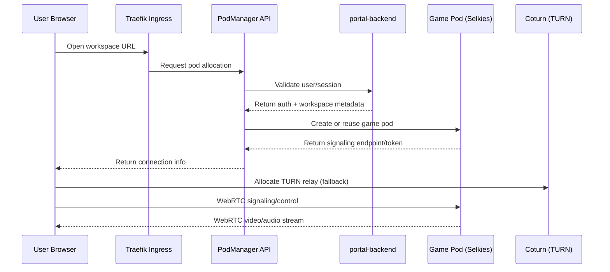
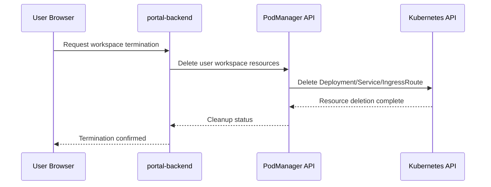

<div align="center">

# CCG-Platform

### Cloud Container Gaming Platform

[](https://github.com/CCG-Platform)
[](../LICENSE)

**컨테이너 기반 클라우드 게이밍 플랫폼**

*Run any game, anywhere, on any device.*

</div>

---

## Overview

CCG-Platform은 **Kubernetes 기반의 클라우드 게이밍 인프라**를 제공합니다.

사용자는 웹 브라우저만으로 고사양 게임을 실행하고, GPU 가속 워크스페이스에서 실시간 스트리밍을 경험할 수 있습니다.

---

## Architecture

```
┌─────────────────────────────────────────────────────────────────┐
│ Client (Browser) │
│ WebRTC Video/Audio Stream │
└──────────────────────────────┬──────────────────────────────────┘
 │
 ▼
┌─────────────────────────────────────────────────────────────────┐
│ Kubernetes Cluster │
│ ┌─────────────┐ ┌─────────────┐ ┌─────────────────────────┐ │
│ │ Traefik │ │ PodManager │ │ Game Containers │ │
│ │ (Ingress) │──│ (API) │──│ ┌───┐ ┌───┐ ┌───┐ │ │
│ └─────────────┘ └─────────────┘ │ │GPU│ │GPU│ │CPU│ ... │ │
│ │ └───┘ └───┘ └───┘ │ │
│ ┌─────────────┐ ┌─────────────┐ └─────────────────────────┘ │
│ │ Selkies │ │ Coturn │ │
│ │ (WebRTC) │──│ (TURN) │ │
│ └─────────────┘ └─────────────┘ │
└─────────────────────────────────────────────────────────────────┘
 │
 ▼
┌─────────────────────────────────────────────────────────────────┐
│ Backend Services │
│ ┌─────────────┐ ┌─────────────┐ ┌─────────────┐ │
│ │ FastAPI │ │ PostgreSQL │ │ Redis │ │
│ │ (Backend) │──│ (DB) │──│ (Cache) │ │
│ └─────────────┘ └─────────────┘ └─────────────┘ │
└─────────────────────────────────────────────────────────────────┘
```

---

## Sequence Diagram



핵심 흐름은 **인증/할당(HTTP)** 후 **실시간 스트리밍(WebRTC)** 으로 전환되는 2단계입니다.

### Session Teardown Sequence



---

## Tech Stack

<table>
<tr>
<td align="center" width="120">

<br><strong>React 19</strong>
</td>
<td align="center" width="120">

<br><strong>FastAPI</strong>
</td>
<td align="center" width="120">

<br><strong>Kubernetes</strong>
</td>
<td align="center" width="120">

<br><strong>Terraform</strong>
</td>
<td align="center" width="120">

<br><strong>PostgreSQL</strong>
</td>
</tr>
</table>

| Layer | Technologies |
|-------|--------------|
| **Frontend** | React 19, Vite, styled-components |
| **Backend** | FastAPI, SQLAlchemy, Celery, Redis |
| **Infrastructure** | AWS EKS, Karpenter, Traefik, Terraform |
| **Streaming** | Selkies (WebRTC), Coturn (TURN/STUN) |
| **Container** | Docker, GHCR (GitHub Container Registry) |

---

## Repositories

| Repository | Description | Status |
|------------|-------------|:------:|
| [**portal-backend**](https://github.com/CCG-Platform/portal-backend) | FastAPI 백엔드 - 인증, 결제, 워크스페이스 관리 |  |
| [**CCGP-ui**](https://github.com/CCG-Platform/CCGP-ui) | React 프론트엔드 - 랜딩, 대시보드, 게임 UI |  |
| [**PodManager**](https://github.com/CCG-Platform/PodManager) | K8s Pod 라이프사이클 관리 API |  |
| [**Selkies**](https://github.com/CCG-Platform/Selkies) | WebRTC 게임 스트리밍 (fork) |  |
| [**TerraformLearn**](https://github.com/CCG-Platform/TerraformLearn) | AWS EKS + Karpenter IaC |  |
| [**Document**](https://github.com/CCG-Platform/Document) | 문서화 표준 및 템플릿 |  |

---

## Features

- **실시간 게임 스트리밍** - WebRTC 기반 저지연 비디오/오디오
- **GPU 가속** - NVIDIA GPU를 활용한 하드웨어 인코딩
- **동적 리소스 할당** - Karpenter로 자동 스케일링
- **사용자 격리** - NetworkPolicy 기반 네트워크 격리
- **Pay-as-you-go** - 분 단위 과금 시스템
- **멀티 리전 지원** *(Coming Soon)*

---

## Quick Links

<table>
<tr>
<td align="center">
<a href="https://github.com/CCG-Platform/Document">
<strong> Documentation</strong><br>
문서화 표준 및 가이드
</a>
</td>
<td align="center">
<a href="https://github.com/CCG-Platform/Document/blob/main/templates/CONTRIBUTING_TEMPLATE.md">
<strong> Contributing</strong><br>
기여 가이드라인
</a>
</td>
<td align="center">
<a href="https://github.com/orgs/CCG-Platform/projects">
<strong> Projects</strong><br>
로드맵 및 이슈 트래킹
</a>
</td>
</tr>
</table>

---

## Getting Started

```bash
# 1. Clone repositories
git clone https://github.com/CCG-Platform/portal-backend.git
git clone https://github.com/CCG-Platform/CCGP-ui.git

# 2. Follow each repository's README for setup instructions
```

> [!TIP]
> 각 레포지토리의 `README.md`와 `AGENTS.md`를 참조하세요.

---

## Contact

- **Email**: [contact@ccgp.dev](mailto:contact@ccgp.dev)
- **Issues**: 각 레포지토리의 Issues 탭 사용

---

<div align="center">

**Made with ️ by CCG-Platform Team**

*Cloud gaming, reimagined.*

</div>

## License
TODO: 수정필요
